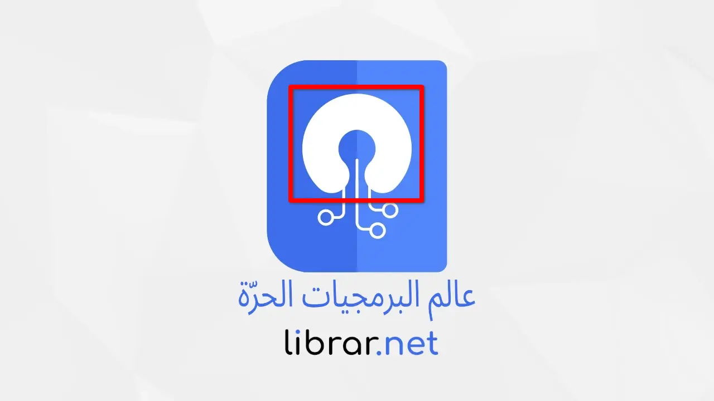
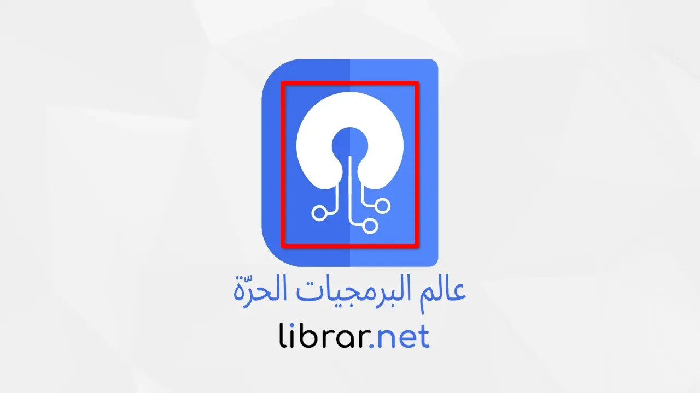

هذه صفحة تعريفية بالمشروع واسباب إنشاء اسمه وشعاره وهويته ونطاقه وأهدافه.

## هدف الموقع

موقعنا هو موقع عربي ينشر مواضيع في شتى مجالات العالم الحر ومفتوح المصدر من برمجيات وتطبيقات ولا سيما أنظمة التشغيل جنو/لينكس، ويحاول تغطية النقص في عالمنا العربي في هذا المجال ولو بنسبة صغيرة.

## عن اسم الموقع

بما أن هدف الموقع يستهدف كتابة المحتوى في مجال المصادر الحرة والمفتوحة من تطبيقات وأنظمة فكانت التسمية العامة هي: عالم البرمجيات الحرة

## عن اسم النطاق

تسمية نطاق الموقع أو ما يُعرف "بالدومين" هو نحت لكلمتي libre و arabia فكان الناتج هو الكلمة LibrAr.

كلمة Librar في اللغة الاسبانية تعني " جعل الشيء حرا، او تحرير بكلمة واحدة"، وهو ما يتناسب مع محتوى الموقع.

## عن شعار الموقع

شعار الموقع يعكس توجهه فكان التصميم مبني على هذا الأساس.

**هذه هي المفاهيم المُدمجة في الشعار:**

شعار open source مع تعديل الحواف

رمز التقنية : circuits

زر power on للتعبير عن قيمة المشروع تقنيا

شكل مبسط لكتاب في إشارة لعنوان Librar او library

كل هذه المفاهيم تعبر جوهرا ومضمونا على هدف الموقع.

## كلمة شكر

الشعار الذي تراه أمامك والمفاهيم المُدمجة فيه هي من تصميم وإبداع الصديق **معاذ جِيجلي**.

كل الشكر والعرفان للاخ معاذ على ما قدمه من عون ومساعدة لنا. 
