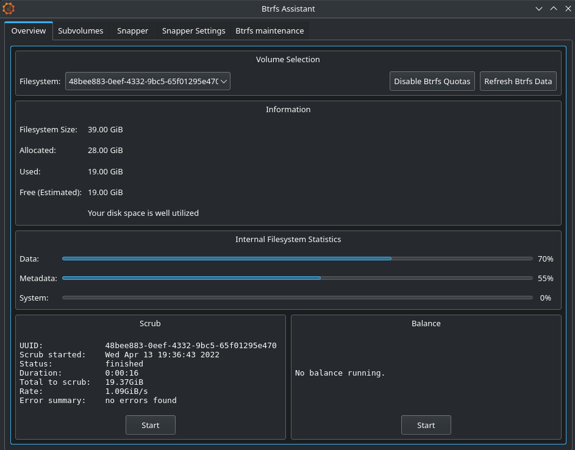

إذا كنت تبحث عن أداة لإدارة نظام ملفات BTRFS ومن ناحية أخرى تُفضل أن تكون بواجهة رسومية على لينكس بدلا من التعامل مع سطر الأوامر، فستتعرف معي في هذا المقال على أداة Btrfs Assistant التي تأتي مع العديد من الميزات وبالتالي تُسهل عليك التعامل مع نظام ملفات BTRFS.

عند الحديث عن توزيعات لينكس قد يكون نظام الملفات الأشهر فيها هو Ext4 لكن مع ظهور نظام ملفات BTRFS إل الساحة والدعم الذي يتلقاه من مجتمع المطورين القائمين على مشاريع مثل _**[fedora](https://librar.net/fedora-37-released/)**_ و openSUSE قد تجعل منه نظام الملفات الأشهر مستقبلا.

## أداة بواجهة رسومية لإدارة نظام ملفات BTRFS

فيما يلي نستعرض لمحة عن أداة Btrfs Assistant وأهم الميزات التي تقدمها.

### لمحة عن أداة Btrfs Assistant

هي أداة بواجهة مستخدم رسومية تُسهل عليك إدارة نظام ملفات BTRFS.

كما هو معلوم يأتي نظام ملفات BTRFS مع العديد من الميزات لا يمكن حصرها في هذا المقال، لكن قد تكون Snapshots هي أهم ميزة فيه.

**ما المقصود بالـ Snapshots؟**

هي أخذ صورة أو لقطات لملفات النظام وإعداداته أو مجلد معين مع إمكانية استرجاعها فيما بعد في حالة ضياع البيانات أو حدوث مشكل في النظام.

### أهم الميزات

هذه هي أهم الميزات التي تقدمها هذه الأداة

- واجهة رسومية تُعطيك نظرة عامة عن البيانات الوصفية لـ Btrfs؛

- إمكانية إنشاء وحذف واستعادة لقطات النظام (snapshots)؛

- وضع لصيانة نظام الملفات (Btrfs Maintenance)؛

- واجهة أمامية لأداة Snapper مع خيار تصفح لقطات النظام (snapshots) واستعادتها؛

- إمكانية إنشاء وتعديل أو حذف الإعدادات الخاصة بأداة Snapper؛

- القدرة على تصفح الملفات واستعادتها بشكل فردي بالنسبة لأداة Snapper.

### لقطات شاشة

فيما يلي نستعرض لقطات شاشة لهذه الأداة.


اضغط على الصور لأخذ نظرة عامة




**مصدر الصور:** الصفحة الرسمية للأداة على موقع GitLab.



### طرق تثبيت أداة Btrfs Assistant على توزيعات لينكس

**بالنسبة إلى Debian و Ubuntu والتوزيعات المبنية عليها.**

ستحتاج إلى تطبيق الخطوات التالية بالترتيب.

لتطبيق الأوامر ستقوم بفتح الطرفية من قائمة التطبيقات أو من خلال الضغط مرة واحدة على **Ctrl + Alt + T** من لوحة المفاتيح.

**1-** تثبيت الحزم الاساسية عن طريق كتابة هذا الأمر في الطرفية.

```shell
sudo apt install git cmake qtbase5-dev qttools5-dev fonts-noto libqt5svg5 libqt5core5a g++ libbtrfs-dev libbtrfsutil-dev
```

**2-** تحميل الملف المضغوط الخاص بالأداة من هنا: **[الرابط](https://gitlab.com/btrfs-assistant/btrfs-assistant/-/tags)**

**3-** بعد ذلك قم بفك الضغط عنه والدخول إلى المجلد المستهدف.

لا بد من أن تكون في نفس مسار المجلد المستهدف عند تطبيق الأوامر.

**4-** في هذه الخطوة ستقوم بكتابة الأوامر التالية بالترتيب في الطرفية.

```shell
cmake -B build -S . -DCMAKE_INSTALL_PREFIX=/usr -DCMAKE_BUILD_TYPE='Release'
```

```shell
make -C build
```

```shell
sudo make -C build install
```

**5-** الخطوة الأخيرة هي اختيارية وتتعلق بتثبيت أداة snapper عن طريق هذا الأمر.

```shell
sudo apt install snapper
```

**بالنسبة إلى توزيعة فيدورا.**

ستحتاج إلى تطبيق الخطوات التالية بالترتيب.

لتطبيق الأوامر ستقوم بفتح الطرفية من قائمة التطبيقات أو من خلال الضغط مرة واحدة على **Ctrl + Alt + T** من لوحة المفاتيح.

**1-** تثبيت الحزم الاساسية عن طريق كتابة هذا الأمر في الطرفية.

```shell
sudo dnf install cmake git qt5-qttools qt5-qtbase qt5-qtsvg g++ qt5-qtbase-devel qt5-qttools-devel libbtrfsutil btrfs-progs-devel
```

**2-** تحميل الملف المضغوط الخاص بالأداة عبر هذا **[الرابط](https://gitlab.com/btrfs-assistant/btrfs-assistant/-/tags)**.

**3-** بعد ذلك قم بفك الضغط عنه والدخول إلى المجلد المستهدف.

لا بد من أن تكون في نفس مسار المجلد المستهدف عند تطبيق الأوامر.

**4-** في هذه الخطوة ستقوم بكتابة الأوامر التالية بالترتيب في الطرفية.

```shell
cmake -B build -S . -DCMAKE_INSTALL_PREFIX=/usr -DCMAKE_BUILD_TYPE='Release'
```

```shell
make -C build
```

```shell
sudo make -C build install
```

الخطوات التالية المتبقية هي اختيارية

**5-** تثبيت أداة snapper عن طريق هذا الأمر.

```shell
sudo dnf install snapper
```

**6-** تثبيت حزمة Btrfs Maintenance بكتابة الأمر التالي.

```shell
sudo dnf install btrfsmaintenance
```

بصفة عامة كانت هذه تحديدا طرق التثبيت على توزيعات لينكس.

في النهاية كان هذا مقال قدمنا فيه تعريفا حول أداة btrfs-assistant مع ذكر أهم الميزات وفي الوقت نفسه قدمنا شرحا لكيفية تثبيتها على مختلف توزيعات لينكس.
