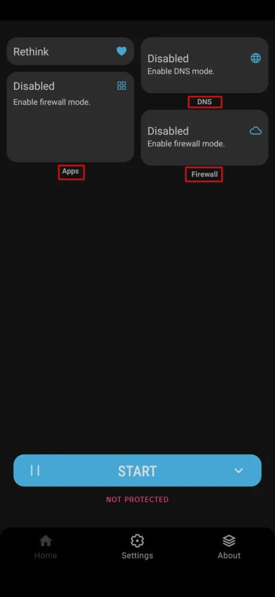
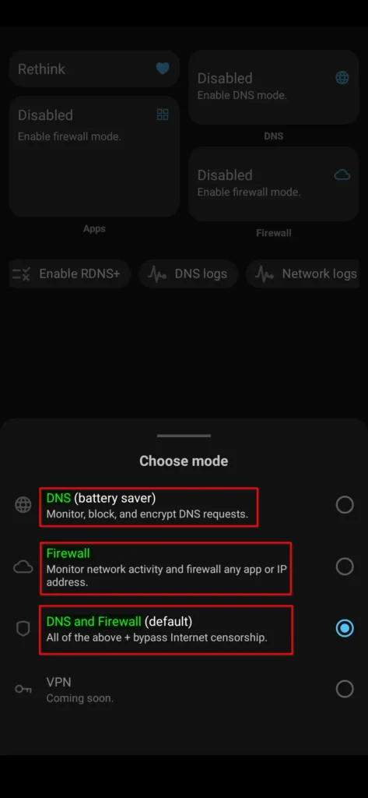
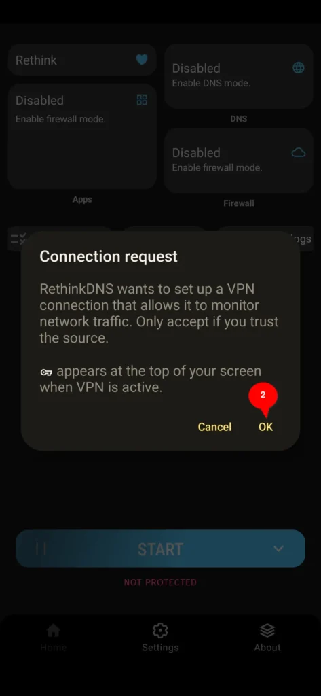

إذا كنت مستخدما لنظام [أندرويد](https://librar.net/neo-store/) وتبحث عن تطبيق يوفر لك جدار حماية مع DNS مخصص ومانع إعلانات فسيكون تطبيق RethinkDNS المجاني والمفتوح المصدر الأداة المناسبة لذلك وقد يوفر عليك عناء تثبيت عدة تطبيقات على هاتفك.

## ما الميزات التي يقدمها لك تطبيق RethinkDNS

فيما يلي أهم ميزات التطبيق

- لا يُشترط أن يكون هاتفك به صلاحيات الروت.

- يوفر لك جدار حماية يسمح لك بحظر أي تطبيق من الوصول إلى الانترنت.

- مانع إعلانات مع قوائم حظر متعددة وإمكانية حجب المواقع المشبوهة.

- مراقبة حركة الاتصالات الواردة والصادرة على الانترنت في هاتفك.

- إمكانية حظر جميع الاتصالات بالشبكة بمجرد قفل هاتفك

### واجهة التطبيق


اضغط على الصور لأخذ نظرة عامة

عند تثبيت التطبيق لأول مرة وتخطي شاشة البداية ستظهر أمامك الواجهة الرئيسية للتطبيق وستلاحظ في الجزء العلوي وجود التبويبات التالية.

#### تبويب خاص بالتطبيقات - Apps

يمكن من خلاله التعامل مع كل تطبيق بشكل فردي، إضافة إلى حظر أو السماح بوصوله للانترنت.

#### تبويب خاص بــ DNS

يشمل مختلف الإعدادات الخاصة بـ DNS حيث يمكنك التبديل بين مختلف خوادم DNS الشائعة مع خيارات أخرى مفصلة سنوضحها في هذا المقال.

#### تبويب خاص بجدار الحماية - Firewall

هنا ستجد إعدادات مفصلة خاصة بجدار الحماية سيتم توضيحها فيما بعد.

في الجزء السفلي للواجهة الرئيسية للتطبيق ستجد الزر START وعند الضغط عليه ستنبثق لك ثلاثة خيارات موضحة كالتالي

- تفعيل وضع DNS فقط.

- تفعيل وضع Firewall فقط.

- تفعيل كل ما سبق (DNS + Firewall).

بعد اختيارك لتفعيل وضع معين سيطلب التطبيق بعض الصلاحيات، قم بالموافقة عليها.

بخصوص الخيار الرابع وهو وضع VPN سيتم إضافته في إصدارات لاحقة حسب مطوري التطبيق.

## شرح مختصر لقسم التطبيقات

من خلال هذه النافذة يمكنك التعامل مع كل تطبيق بشكل فردي وتستطيع تطبيق مايلي

- قطع الإتصال بالانترنت لتطبيق معين بالنسبة لشبكة Wifi.

- حظر وصول تطبيق معين للانترنت بالنسبة لشريحة الهاتف.

- تصفية النتائج حسب الإعدادات التي قمت بها داخل هذه النافذة.

## شرح مختصر لقسم DNS

هنا يمكنك تحديد أحد الخيارات التالية

- وضع System DNS وهو غالبا خادم dns الافتراضي على جهاز التوجيه.

- وضع Other DNS يمكنك من خلاله اختيار خادم dns مخصص.

- وضع RethinkDNS خاص بالتطبيق وتجد ضمنه خيارات تخصيص كثيرة.

دون أن ننسى أيضا وجدود إعداد يسمح تفعيله بمنع تسريبات DNS.

## شرح مختصر لقسم جدار الحماية

من خلال هذه النافذة يمكنك تخصيص إعدادات جدار الحماية ومنع التطبيقات من الوصول للانترنت بعدة طرق نذكر منها.

- حظر جميع التطبيقات من الوصول للانترنت عند قفل هاتفك.

- حظر الاتصالات على أي تطبيق غير نشط أو لم يتم استخدامه.

- حظر الاتصالات على التطبيقات المثبتة حديثا على هاتفك.

- وغيرها من الإعدادات الأخرى.

## الروابط الرسمية لتطبيق RethinkDNS

يمكنك تنزيل وتثبيت التطبيق على هاتفك بالاستعانة بالروابط التالية

- من خلال **[متجر التطبيقات F-Droid](https://f-droid.org/packages/com.celzero.bravedns/)**.

- من خلال **[الموقع الرسمي للتطبيق](https://rethinkdns.com/download)**.

كان هذا مقال قدمنا فيه شرحا موجزا عن أداة مجانية ومفتوحة المصدر لنظام أندرويد توفر لك جدار حماية وإمكانية اختيار DNS مخصص إضافة إلى مانع إعلانات مع قوائم حظر متعددة، كل هذه الميزات مجتمعة في تطبيق واحد.
